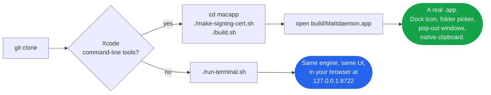
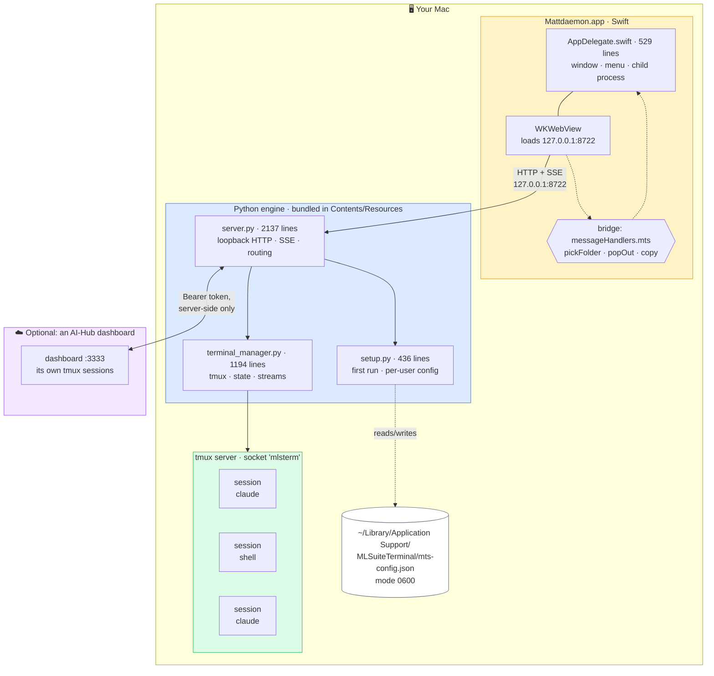
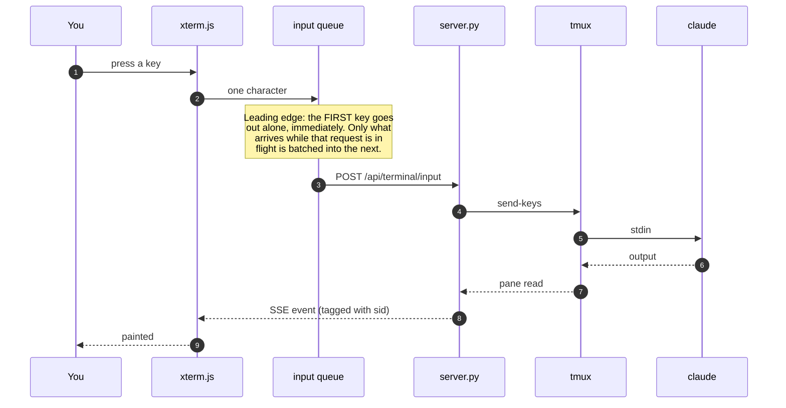
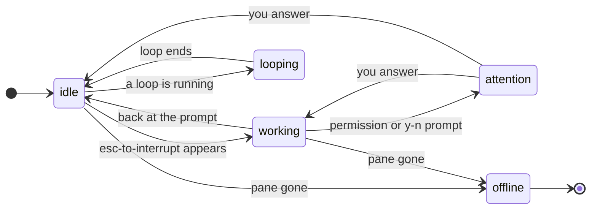
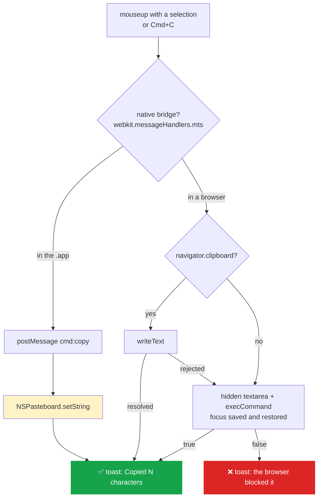
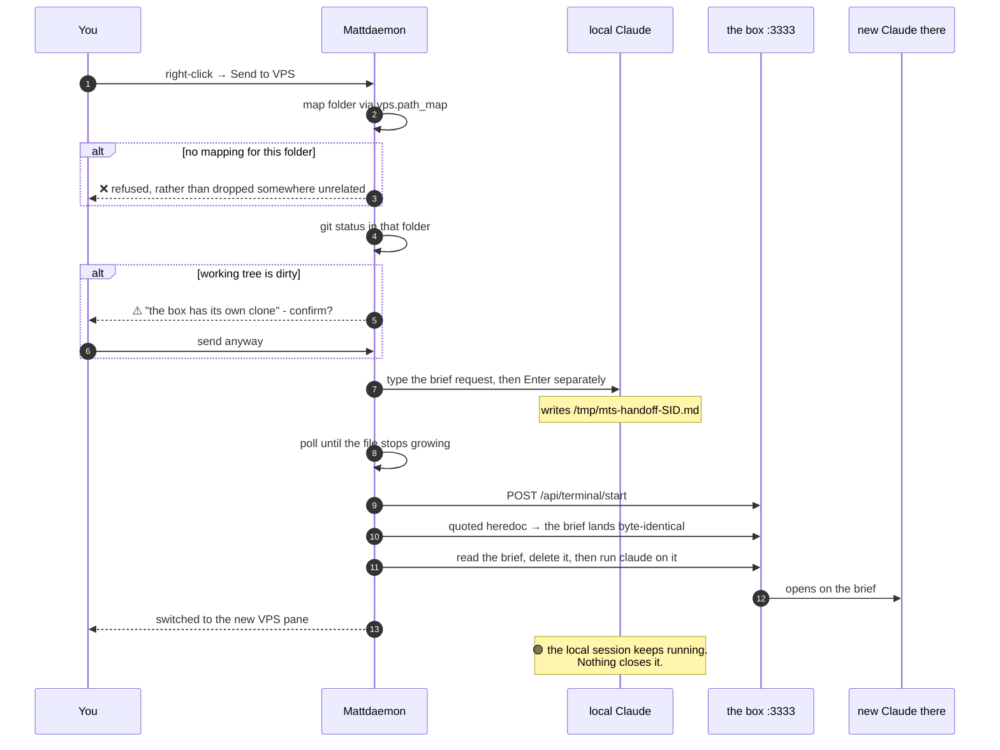
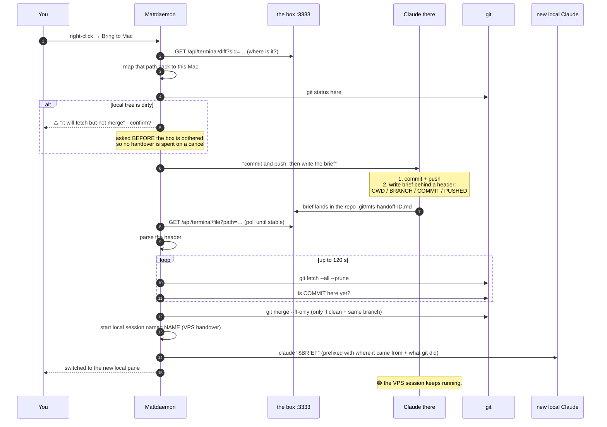
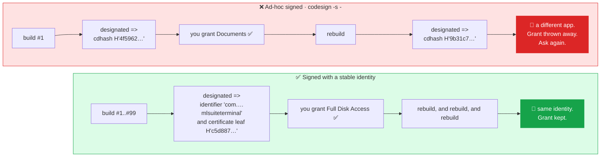
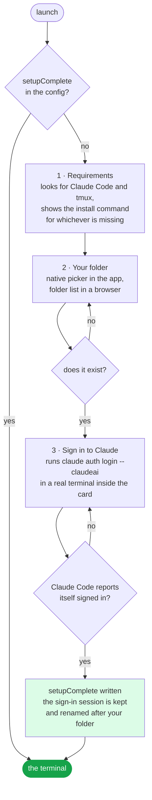
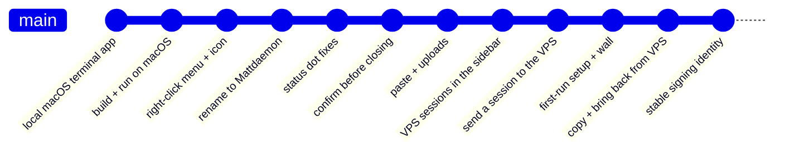

<div align="center">

# Mattdaemon

**Claude Code in a terminal that keeps running.**

A small, self-contained Mac app with tmux-backed terminal sessions that survive
closing the window - so you can come back to whatever Claude was doing. Served on
loopback only. Carries nobody's account.


</div>

---

## Contents

| | |
|---|---|
| **Start here** | [What it is](#what-it-is) · [Two ways to run it](#two-ways-to-run-it) · [First run](#first-run) |
| **How it works** | [Architecture](#architecture) · [The four pieces](#the-four-pieces) · [A keystroke's journey](#a-keystrokes-journey) · [Session state](#session-state-what-the-dots-mean) · [Status hooks](#the-hooks-that-make-the-dots-honest) |
| **Features** | [The window](#the-window) · [Copy and paste](#copy-and-paste) · [Handover: Mac to VPS](#handover-mac-to-vps) · [Handover: VPS to Mac](#handover-vps-to-mac) · [Uploads](#uploads) |
| **Operating it** | [File access, once](#file-access-granted-once-not-every-week) · [Configuration](#configuration) · [Give it to someone else](#give-it-to-someone-else) |
| **Reference** | [HTTP API](#http-api) · [Constants](#constants-that-matter) · [Repository](#repository-and-git-setup) · [Testing](#testing) · [Troubleshooting](#troubleshooting) · [Design decisions](#design-decisions) |

---

## What it is

It is the same terminal as the AI-Hub dashboard at `:3333`, pointed at your own
machine and served on `127.0.0.1` only - nothing is exposed to the network.

Sessions are backed by **tmux**, so they outlive the window: close the app, reopen
it, and your shells, running processes and scrollback are still there. They do not
survive a reboot, because tmux does not.

**It carries nobody's account.** On first launch it asks for a Claude Code login
(your own subscription) and the folder your sessions should open in, and stores
both per user *outside* the app bundle - so the `.app` can be handed to someone
else as-is.

```
┌──────────────────────────────────────────────────────────────────────────┐
│  Mattdaemon                                                              │
├───────────────────┬──────────────────────────────────────────────────────┤
│ LOCAL          +  │  ┌────────────────────────┬───────────────────────┐  │
│  ● AI-Hub         │  │ ● AI-Hub               │ ● Whittle             │  │
│  ● Whittle        │  │                        │                       │  │
│  ● Morning        │  │  $ claude              │  $ npm run dev         │  │
│                   │  │  > building the thing  │  ready on :3000       │  │
│ VPS            +  │  │                        │                       │  │
│  ● CRM + Track    │  ├────────────────────────┴───────────────────────┤  │
│  ● Facebook ads   │  │ ● Morning                                      │  │
│  ● SEM            │  │  $ ...                                         │  │
│                   │  │                                                │  │
│ ▸ Saved (2)       │  └────────────────────────────────────────────────┘  │
│ ⚙                 │                                          [preview ▸] │
└───────────────────┴──────────────────────────────────────────────────────┘
     sidebar                        the wall (1-4 panes)
```

---

## Two ways to run it



**Native app** - a real `.app` you double-click. Needs a one-off build on the Mac
(Swift toolchain / Xcode command-line tools).

```sh
cd macapp
./make-signing-cert.sh    # once per Mac - see "File access, granted once"
./build.sh
open build/Mattdaemon.app
```

`build.sh` runs `swift build`, assembles `Mattdaemon.app`, bundles the Python engine
and `static/` into it, and codesigns it so Gatekeeper lets it launch. The result is
fully self-contained - move the `.app` anywhere and double-click it.

**No build** - no Xcode, no compilation. Good enough for daily use.

```sh
./run-terminal.sh
```

Starts `python3 server.py --port 8722` in the background, waits until it answers,
then opens that URL in your browser. `Ctrl-C` stops it; the script traps the exit
and shuts down the server it started.

Requirements either way: `python3`, `tmux`, `curl` on your `PATH`
(`brew install tmux` if you have not got it).

---

## Architecture

Everything is one process tree on your Mac, plus an optional read/write proxy to a
remote dashboard. No daemon you did not start, no service in the cloud.



**The token never reaches the browser.** VPS calls are proxied by `server.py`, which
holds the token; the page only ever talks to `127.0.0.1`.

### The four pieces

| File | Lines | Owns |
|---|---:|---|
| [`server.py`](server.py) | 2137 | The loopback HTTP server, SSE streams, the setup API, the VPS proxy and poller, and both handover directions. |
| [`terminal_manager.py`](terminal_manager.py) | 1194 | Everything tmux: creating, listing, writing to, resizing and killing sessions; reading pane output; and deciding what state a session is in. |
| [`setup.py`](setup.py) | 436 | First-run state, requirement checks, folder validation, and the per-user config file. |
| [`static/index.html`](static/index.html) | 3005 | The whole front end - xterm.js, the session wall, sidebar, settings, setup card. One file, no build step. |
| [`macapp/`](macapp/) | 555 | The Swift shell: a window, a `WKWebView`, the menu bar, the bridge, and `build.sh` / `make-signing-cert.sh`. |

Sessions live in a **dedicated tmux server** on socket `mlsterm`, isolated from any
other tmux you run. Scrollback is kept at 50 000 lines per session.

---

## A keystroke's journey

Two things here are not obvious, and both were bugs first.



**Why the leading edge matters.** It used to wait 16 ms and send whatever had piled
up, which merged ordinary typing into multi-character writes. Claude Code reads a
multi-character chunk as a **paste**, and several keys only work as keystrokes: `!`
opens bash mode only as a single press into an empty prompt; in a paste it is just
an exclamation mark. A batched Enter becomes a line break instead of submitting.

**Solo keys** never share a write with anything else, for the same reason:

```
\r   \n   Esc   Ctrl-C   Ctrl-D   Tab
```

Escape merged with the next character is worse still - together they form an escape
sequence that means something else entirely.

**One connection for the whole wall.** `GET /api/terminal/stream-multi?sids=a,b,c`
streams several sessions down a single SSE connection, each event tagged with the
session that produced it. A browser allows about six connections per origin; a pane
each would have starved everything else the page needs to do.

---

## Session state: what the dots mean

The dot next to each session is not decoration - it is a real classification, and
getting it wrong cost real hours before it was fixed.



| Dot | State | Means |
|:---:|---|---|
| 🟢 | `idle` | Back at the prompt, waiting for you. **Even if a background agent is still churning** - the dot tracks the main loop only. |
| 🟡 | `working` / `looping` | Actively working: `esc to interrupt` is on screen, a hook stamp under 90 s old, or a real subprocess is alive. |
| 🔴 | `attention` | Wants an answer - a permission box or `(y/n)` in the **live region at the bottom of the pane**, or a Notification hook. |
| ⚫ | `offline` | The pane is gone. |

Two lessons are baked into that logic:

- **Only the bottom of the pane counts.** Matching the whole visible screen meant an
  *already answered* permission box, or any transcript text containing `(y/n)`, kept
  the dot red long after the session had moved on.
- **Hook stamps expire.** `Stop` does not fire when you interrupt Claude with Esc, so
  a `working` stamp could stick for ever. A stamp older than **90 s** is ignored, and
  the pane-text and process heuristics are the floor underneath it.

### The hooks that make the dots honest

Two of those inputs are not in the app at all - they are Claude Code hooks, and
without them the dots fall back to screen-scraping and are wrong in exactly the
cases they exist for. A fresh Mac needs them installed, which is one command:

```bash
./hooks/install.sh
```

| Hook | Stamps | Why the pane alone cannot tell you |
|---|---|---|
| `hooks/webterm-state.sh` | `@webstate` | A session that has stopped and one waiting on a permission box can look identical on screen. |
| `hooks/webloop-stamp.py` | `@webloop` | A `/loop` between iterations sits at a prompt looking finished. The stamp carries the loop's own next-tick deadline, so a dead loop goes honestly green. |

`webterm-state.sh` also stamps **`@webneed`** - *why* a red session wants you, as
`kind|epoch|headline`. The rail shows the kind as a chip on the row and the
sentence as its tooltip, so a plan awaiting your go-ahead is distinguishable
from a Bash permission without opening the session:

| Kind | Stamped on | Headline |
|---|---|---|
| `plan` | `PreToolUse` with `ExitPlanMode` | "plan ready for your go-ahead" |
| `approval` | `PermissionRequest` | the Bash command, or the file being edited |
| `question` | `PreToolUse` with `AskUserQuestion`, or a Notification | the question itself |

This is the one thing a pane scrape genuinely cannot answer: a plan and a
permission draw nearly the same box, and the only text available to scrape is
whatever happened to sit above the options. The hook is handed the tool name and
its input at the moment the turn stopped, so it knows. `_pane_reason` in
`terminal_manager.py` stays underneath as the floor, for a session that was
already waiting before the hook was installed and for an agent that fires no
hooks at all. The stamp is cleared by `Stop`, `PostToolUse` and any ordinary
`PreToolUse`, so an answered box leaves nothing behind, and `all_states` only
answers for sessions the dots already call `attention` - a stale stamp can never
turn a green row red.

The script copies both into `~/.claude/hooks/`, wires them into the eight events
`settings.json` needs, and is safe to re-run: it backs the file up, adds only
what is missing, and leaves your own hooks and settings alone. Restart your
Claude Code sessions afterwards. The VPS has its own copy of the state hook
(`aihub-web` socket scope, and it owns Telegram pushes); these are the Mac half.

---

## The window

- **Session wall** - 1 to 4 panes in a grid, manual ordering, and a *Saved for later*
  folder for sessions you want to keep but not look at. Each layout looks like its
  icon in the picker: three panes is one big one on the left at full height with the
  other two stacked beside it, not three of a size.
- **Changing the layout changes only the layout.** Go from two panes to three and the
  two you were looking at stay exactly where they are; the new pane waits, empty,
  until you put something in it. It used to fill itself with the next unused session,
  which both added one you had not asked for and left you to undo it if you wanted a
  different one there. Narrowing keeps what it hides, so going back up finds the wall
  as you left it.
- **Pop-out windows** - drag a session out and it gets a real window, which can live
  on a second monitor. Same page, same server, `?solo=<sid>` - no second terminal
  implementation to keep in step. The shell is a tmux session and outlives any window
  onto it, so closing one is not closing the session; the grid takes it back.
- **What a session builds opens in your browser.** A visual plan from `/farm`, a
  file shown with `term-show`, a URL printed in the output and clicked: all of it
  is handed to your default browser, including a plan a VPS session wrote. There
  is no web view inside the app, on purpose - an iframe cannot show half the web
  (`x-frame-options` makes a panel that is permanently blank), a plan is a
  full-width document, and a browser tab can be scrolled, kept, printed and
  shared while you carry on in the terminal.
- **The plan button** reopens the latest one for the focused session, for when you
  have closed the tab. It is hidden until that session has made something.
- **Right-click a session** - rename, save for later, close, and whichever handover
  direction applies.
- **Survives sleep.** A Mac waking up leaves a TCP connection that is gone without
  either end being told. The SSE relay times out after 45 s (three missed 15 s pings)
  and the front end reconnects, instead of staring at a frozen terminal.

---

## Copy and paste

**Marking text copies it.** Drag across anything in a terminal and it is on the
clipboard when you let go - no second action, ⌘V works straight away. ⌘C does the
same for a selection, and is left alone when there is none, so it stays the interrupt
the shell expects.

Worth knowing why this needed writing at all:

> xterm keeps its **own selection model**. The highlighted text is not a DOM
> selection, so WebKit's own Copy - the Edit menu item, and therefore ⌘C - found
> nothing to copy and quietly left the clipboard holding whatever was in it before.
> "It says Copied and copies nothing" was not a clipboard bug. The copy never
> happened, and nothing said so.



Three routes, best first, and it only says *Copied* when one of them actually
succeeded:

1. **The native bridge → `NSPasteboard`.** No user-gesture rule, no secure-context
   rule, and it cannot half-succeed. The `.app`'s path.
2. **`navigator.clipboard`** for a plain browser. `127.0.0.1` is a secure context, so
   it is available - but it wants a live user gesture, which is why the copy happens
   *inside* the `mouseup`, not on a timer that would have dropped it.
3. **A hidden textarea + `execCommand`**, with focus captured and put back (or the
   terminal stops taking keystrokes the moment you copy out of it). Focus-flaky,
   hence last.

Pasting in is unchanged: ⌘V types into the shell, and a pasted screenshot is uploaded
into the session instead.

---

## Handover: Mac to VPS

Right-click a **local** session → **Send to VPS**.

A running process cannot be moved between machines - its memory, file descriptors and
tty are Mac-local - so this is a *handoff*, not a migration.



The brief travels through a **quoted heredoc**, so the shell performs no expansion at
all and prose containing `$`, backticks or quotes arrives intact. A line equal to the
delimiter would end it early, so those are defanged first.

A session running a plain shell has no conversation to hand over, so it is simply
reopened in the mapped folder.

---

## Handover: VPS to Mac

Right-click a **VPS** session → **Bring to Mac**. The mirror of the above, with the
part the outbound direction does not need: **the files.**

Going out, the box already has its own clone and only needs to know what to do.
Coming back, this Mac is behind by whatever the box has been building, so a brief on
its own would describe files that are not here.



### Git is deliberately two separate steps

| Local state | Fetch | Merge | Why |
|---|:---:|:---:|---|
| Clean, same branch | ✅ | ✅ fast-forward | Nothing of yours to lose. |
| Uncommitted changes | ✅ | ❌ | You have work here. Moving your HEAD under you is help nobody asked for. |
| On a different branch | ✅ | ❌ | The work belongs on its own branch; switching for you is a decision, not a convenience. |
| Would not fast-forward | ✅ | ❌ | Diverged. Reported in plain words. |
| Commit never arrived (120 s) | ✅ | ❌ | The box probably could not push. Said so, rather than silently opening on files that are not here. |

Fetching is always safe and is what actually moves the work, so it happens whatever
state the tree is in. The result - whichever row you landed on - is written into the
opening prompt, so the local Claude knows exactly what it is working with.

### Where the brief lives

The brief is read back through the box's **own file endpoint**, so no shell is needed
on the far side (Claude owns that prompt - there is nothing to type an `rm` into). It
is written to `<repo>/.git/mts-handoff-<id>.md`: inside the folder that endpoint
serves, and somewhere git itself never looks, so a handover never leaves a stray file
in the working tree.

The files do stay there afterwards. To clear them:

```sh
find . -name 'mts-handoff-*.md' -path '*/.git/*' -delete
```

### Folder mapping

One mapping, read in both directions, so a session sent out and brought back lands in
the folder it started in. **Settings → VPS → Folder mapping**, one `local = remote`
per line. Longest match wins; subfolders follow. There is no built-in default: one
machine's folder layout is nobody else's.

```
~/Documents/AI-Hub  =  /home/aihub/AI-Hub
~/Documents/mlsuite =  /home/aihub/mlsuite
```

---

## Uploads

Paste a screenshot, drop a file from Finder, or press **Attach**: the bytes go to the
session's `.uploads` directory and the returned path is typed into the prompt, so
Claude can read a file that only exists on your Mac. Limit 5 MB. A plain-text paste
falls through to the shell as normal.

---

## File access, granted once, not every week

macOS asks an app before it may read your Documents, Desktop or Downloads. That is
fine once. It was happening again and again for a reason worth knowing.



An **ad-hoc signed** app - which is what a locally built app gets by default - has no
signing identity, so the only thing macOS can identify it by is the hash of the binary
itself. Rebuild it and that hash changes, so as far as the privacy system is
concerned this is a different app that happens to have the same name and icon, and
every permission you granted the last one is gone.

**The fix, once per Mac:**

```sh
./macapp/make-signing-cert.sh     # creates a self-signed code-signing certificate
./macapp/build.sh                 # picks it up automatically from then on
```

Then grant it properly, once:

> **System Settings → Privacy & Security → Full Disk Access → + → Mattdaemon**

Full Disk Access rather than folder-by-folder, because this is a terminal: the
sessions in it run Claude Code against whatever project you open, and answering a
dialog per folder for the rest of time is the thing you are trying to stop. It is the
same grant people give Terminal.app and iTerm, for the same reason.

Two things worth knowing:

- **The certificate is self-signed and local.** Not a Developer ID; it does not
  notarise anything and does not make the app distributable. It makes *your* builds
  keep *your* permissions. Someone who clones this repo and builds without running
  the script still gets a working ad-hoc build - it just forgets.
- **tmux outlives the app.** A tmux server started by an *older* copy does not inherit
  the new grant. If prompts survive the change, that server is why: quit the app,
  `tmux -L mlsterm kill-server` (this ends your local sessions), and reopen. Adding
  `~/.local/bin/tmux` to Full Disk Access closes the same gap without losing anything.

---

## First run

The first launch shows a setup card instead of the terminal. Nothing can open a shell
until it is done - **the server refuses, not just the page.**



**The app never sees a password or a token.** Step 3 is the same flow as signing in
from Terminal.app: it types the command, the browser handshake happens between Claude
Code and Anthropic, and this server only asks Claude Code *who is signed in*.

Afterwards all three live behind the gear in the sidebar, along with the optional VPS.
Signing in as someone else, changing folder, or re-running the whole setup are all
there.

---

## Configuration

```
~/Library/Application Support/MLSuiteTerminal/mts-config.json
```

Per user, outside the app bundle, `0600` because it can hold a VPS token. **The app
writes it; you never have to.** A `mts-config.json` next to `server.py` is read as a
fallback for a source checkout, and never written.

```jsonc
{
  "setupComplete": true,
  "home": "~/Documents/my-project",   // where new sessions open
  "port": 8722,

  // Optional, off by default.
  "vps": {
    "base_url": "http://203.0.113.10:3333",
    "token": "PUT_DASHBOARD_TOKEN_HERE",
    "path_map": {
      "~/Documents/my-project": "/home/you/my-project"
    }
  }
}
```

Until someone connects a VPS there is no VPS section and no mention of it outside
Settings: **a fresh install is a purely local terminal.**

Changing the working folder applies to sessions you open from then on; the ones
already running stay where they are, because a running shell cannot be moved.

---

## HTTP API

Everything the page can do, it does over this. All of it is loopback-only; a `vps:`
prefix on a session id routes the same call through the proxy to the box instead.

### Terminal

| Method | Path | Does |
|---|---|---|
| `GET` | `/api/terminal/sessions` | List sessions, local and (namespaced `vps:`) remote. |
| `GET` | `/api/terminal/states` | The dot for every session. |
| `GET` | `/api/terminal/stream?sid=` | SSE output for one session. |
| `GET` | `/api/terminal/stream-multi?sids=a,b,c` | SSE for several, each event tagged with its `sid`. |
| `GET` | `/api/terminal/file?path=` | Serve a file a session produced (restricted to the working folder). |
| `GET` | `/api/terminal/plan?path=` | Serve a visual-plan HTML to the browser (`plans/*.html`). |
| `GET` | `/api/terminal/health` | Timing counters - how the app is behaving, in numbers. |
| `POST` | `/api/terminal/start` | New session. |
| `POST` | `/api/terminal/input` | Write to a session. |
| `POST` | `/api/terminal/resize` | Resize a pane. |
| `POST` | `/api/terminal/rename` | Rename. |
| `POST` | `/api/terminal/stop` | Kill a session - **the only path that destroys a shell.** |
| `POST` | `/api/terminal/upload` | Base64 file into the session's `.uploads` (5 MB cap). |
| `POST` | `/api/terminal/send-to-vps` | Mac → VPS handover. |
| `POST` | `/api/terminal/bring-from-vps` | VPS → Mac handover. |

### Setup

| Method | Path | Does |
|---|---|---|
| `GET` | `/api/setup/state` | What is still missing before a shell may open. |
| `GET` | `/api/setup/browse` | Folder list, for the in-page picker. |
| `POST` | `/api/setup/folder` | Validate and store the working folder. |
| `POST` | `/api/setup/login` | Open a real session running `claude auth login`. |
| `POST` | `/api/setup/complete` | Finish - refuses without a login. |
| `POST` | `/api/setup/vps` | Save address + token + path map; refuses if the box does not answer. |
| `POST` | `/api/setup/reset` | Back to first-run. |

Both handovers are routed **before** the local/VPS split, because they drive both
machines at once. They are also slow by nature, which is why the server is a
`ThreadingHTTPServer` - a handover waiting on the box's Claude never blocks a
keystroke.

---

## Constants that matter

| Constant | Value | Why that number |
|---|---|---|
| `TMUX_SOCKET` | `mlsterm` | A dedicated tmux server, isolated from any other tmux you run. |
| `TMUX_HISTORY` | `50000` | Lines of scrollback kept per session. |
| `VPS_TIMEOUT` | `6 s` | Non-streaming calls to the box. It is one hop away. |
| `_VPS_REFRESH` | `3.0 s` | How often the background poller asks the box - **off the request path**, so a slow box never stalls a local keystroke. |
| `_VPS_STALE` | `25.0 s` | Older than this and the box stops counting as online. |
| SSE read timeout | `45 s` | Three missed 15 s pings. Long enough never to fire on a healthy idle stream, short enough that a woken Mac reconnects promptly instead of freezing. |
| `_WEBSTATE_WORKING_TTL` | `90.0 s` | A `working` hook stamp older than this is ignored - `Stop` does not fire when you interrupt Claude. |
| `BRIEF_TIMEOUT` | `300 s` | A session may be mid-task; the typed prompt queues behind whatever it is doing. |
| `_SUBMIT_DELAY` | `0.9 s` | Between typing a prompt and sending the Enter, so Claude reads it as a submit and not a line break. |
| `PULL_WAIT` | `120 s` | How long to keep fetching for the box's commit - a push and a fetch are two machines racing. |

---

## Repository and git setup



| | |
|---|---|
| **Remote** | `https://github.com/Sivertsen0007/Mattdaemon` (private) |
| **Branch** | `main` |
| **Working copy** | `~/Documents/Mattdaemon` |
| **History** | 12 commits, complete |

### Where it came from

The app was built inside the AI-Hub monorepo, at
`clients/_self/Work/dev/mac-terminal`, on the branch `feat/mac-terminal-app`. It was
split out with history intact:

```sh
git subtree split -P clients/_self/Work/dev/mac-terminal -b mattdaemon-split
git init -b main ~/Documents/Mattdaemon
git -C ~/Documents/Mattdaemon fetch ~/Documents/AI-Hub mattdaemon-split
git -C ~/Documents/Mattdaemon reset --hard FETCH_HEAD
```

`subtree split` rewrites each commit that touched that folder into a commit whose root
*is* that folder, so all ten original commits survived with their messages and dates.
Fetching a single branch into a fresh repo brings only the objects reachable from it -
the result is 480 KB of `.git`, not a copy of the monorepo.

**Why split it at all:** the README tells other people to `git clone` and build. A
clone of AI-Hub would hand them every client's data, `state.json` and the rest. The
app also has its own release cadence, and its branch was never going to merge into
AI-Hub's `main` - which is also why nothing had to be deleted over there: the app only
ever existed on that feature branch.

### What is deliberately not committed

| Path | Why |
|---|---|
| `mts-config.json` | Can hold a live VPS token. Gitignored; `build.sh` **fails the build** if one ever ends up in `Contents/Resources`. |
| `macapp/build/`, `macapp/.build/` | Build output. |
| `__pycache__/`, `*.pyc` | Obviously. |

The example VPS address in the source is `192.0.2.10` / `203.0.113.10` - reserved
documentation ranges, not anybody's box.

---

## Testing

Nothing here is mocked at the layer that matters: the shells are real shells, the
clipboard is the real clipboard, and the repositories are real repositories.

| Command | Needs | Proves |
|---|---|---|
| `python3 server.py --selftest` | tmux | Boots the real loopback server, starts a tmux session, streams its output, types an `echo` of a token, and confirms that token round-trips back out of a real shell. Also that `GET /` serves the real UI and every asset it references returns 200 with the right content type. |
| `python3 server.py --selftest-multi` | tmux | Drives two real shells down one merged stream and asserts each one's output is tagged with its own session, and never with the other. |
| `python3 server.py --selftest-setup` | nothing | 17 checks against a throwaway config (`MTS_CONFIG`): a fresh install needs setup, a shell is refused until it is finished, a bad folder is rejected, a real one takes effect without a restart, a VPS that does not answer is not saved, `complete` refuses without a login, `reset` returns to first-run, and the config is written `0600`. |
| `python3 server.py --selftest-handover` | git | 20 checks: the path map read backwards (longest prefix wins, unmapped is refused, out-and-back lands where it started), the brief's header, where the box is told to write it, and the git step **against real throwaway repositories** - clean clone fast-forwards and the file appears; dirty clone fetches but does not merge and the user's file is untouched; an unpushed commit is reported rather than waited on for ever. |
| Playwright pass | Chromium | Opens a session, echoes a token, **drags the mouse across it**, and asserts the *system clipboard* now holds exactly that text - from a clipboard deliberately loaded with something else first, so "it was already there" cannot pass for a copy. Then clears it and proves ⌘C does the same. Also walks the setup card as a new user. |
| `python3 test_terminal_worktree.py` | git | 74 checks against real throwaway repositories: a worktree group is created on the branch and repo you pick, dispose cannot escape its own folder (`../../repo`, `..`, `/etc` are all refused), your own checkout and its `.env` are never touched, and a disposed worktree's branch survives by default so commits are not binned by a cleanup. |
| `python3 test_webneed.py` | tmux | 23 checks on the status hook and its reader, end to end: a real tmux server on its own socket, the hook invoked exactly as Claude Code invokes it (event in argv, JSON on stdin), and `all_states` on the other side. Proves `ExitPlanMode` reads as a plan where the pane cannot tell, that a headline carrying pipes or tabs cannot break the field the stamp travels in, that `Stop` / `PostToolUse` clear it, and that a green or yellow session is never asked what it wants. |
| `swift build -c release` | Xcode CLT | The app compiles with the bridge. macOS only. |

---

## Troubleshooting

| Symptom | Cause | Fix |
|---|---|---|
| Asked for file access again after a rebuild | Ad-hoc signature - the grant was pinned to the binary hash | `./macapp/make-signing-cert.sh`, rebuild, grant once more. It sticks from then on. |
| Still asked, even after signing | The tmux server was started by an older copy of the app | Quit, `tmux -L mlsterm kill-server` (ends local sessions), reopen. Or add `~/.local/bin/tmux` to Full Disk Access. |
| "Could not copy - the browser blocked it" | No native bridge and `navigator.clipboard` refused | You are in a browser on a non-secure origin. Use `127.0.0.1`, not a LAN IP. |
| Handover: *no local path is mapped for …* | The folder has no entry in `path_map` | Settings → VPS → Folder mapping. Refusing beats dropping the session somewhere unrelated. |
| Handover: *did not produce a brief within 300s* | The far session is mid-task, waiting on a permission prompt, or its folder is outside what its terminal can serve | Answer the prompt over there and try again. |
| Handover: *commit never arrived* | The box could not push | Check its git remote and permissions; the brief says what it managed. |
| A plan finished and no browser window appeared | The app is older than the page it is serving | `openExternal` is a bridge command; a build from before it falls back to `window.open`, which WebKit drops without a user gesture. Rebuild: `./macapp/build.sh`. Clicking **Plan** still works meanwhile. |
| Terminal frozen after the Mac wakes | The SSE relay died with the connection | It reconnects itself within 45 s. |
| Gatekeeper refuses a copied `.app` | Ad-hoc / self-signed, from another Mac | Right-click → **Open** the first time, or `xattr -dr com.apple.quarantine Mattdaemon.app`. |
| Second launch does nothing | Single-instance guard | It asks the running copy to show its window instead. If that one lost its window, this is what brings it back. |

---

## Give it to someone else

The `.app` is self-contained and personal to nobody: no folder, no login, no token
travels with it. Copy `build/Mattdaemon.app` across and it opens on the setup card for
whoever launches it, against **their own** Claude subscription.

- Everything personal lives in `~/Library/Application Support/MLSuiteTerminal/`, which
  is per user and never inside the bundle. `build.sh` fails the build if a
  `mts-config.json` ever ends up in `Contents/Resources`.
- The Claude login is Claude Code's own, in their Keychain. This app only asks it who
  is signed in; it never handles a credential itself.
- They need Claude Code and tmux installed; step 1 of setup tells them so, with the
  command to fix it.
- To hand over your own copy, or to test the first-run experience:
  **Settings → Run first-time setup again.**

---

## Design decisions

The short version of why it is shaped like this.

| Decision | Because |
|---|---|
| **tmux, not a pty per browser tab** | The whole point is that closing the window does not stop the work. |
| **One HTML file, no build step** | The front end can be edited and reloaded (⌘R) without a toolchain. A terminal app that needs `npm install` to fix a colour is a worse terminal app. |
| **Loopback only** | There is no authentication, and there does not need to be, because there is nothing to reach. |
| **The VPS token stays server-side** | The page never holds it, so a bug in the page cannot leak it, and it never travels inside the `.app`. |
| **The box is polled on its own thread** | Asking it inside a request made every local answer wait on a network hop. Six of those held every connection the browser had, and the app got stickier the longer it ran. |
| **Handovers are handoffs** | A process cannot move between machines. Pretending otherwise would mean lying about what arrived. |
| **Refuse rather than guess** | An unmapped folder, a missing commit, a dirty tree: each is reported, not worked around. Wrong-but-quiet is the expensive failure. |
| **The dot tracks the main loop only** | A background agent still churning is not a session that needs you. Reading it as busy cost hours of a done session looking unfinished. |
| **No launchd agent** | Running at login would be convenient, and installing a background agent nobody asked for is not a thing to do quietly. Described in the history if it is ever wanted. |
